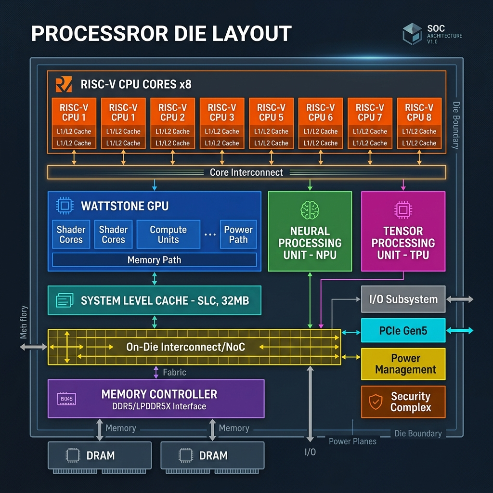
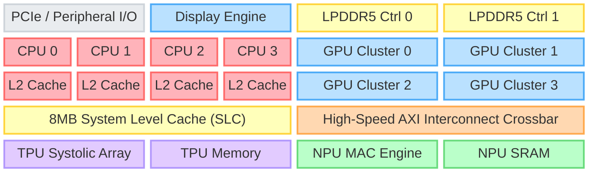
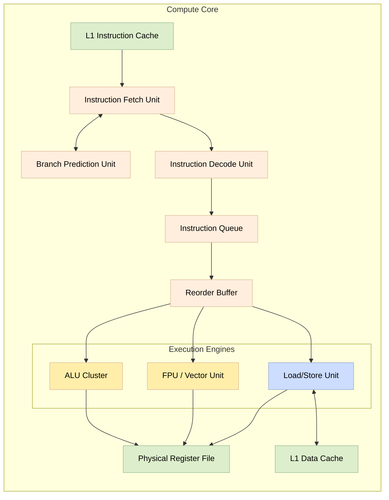
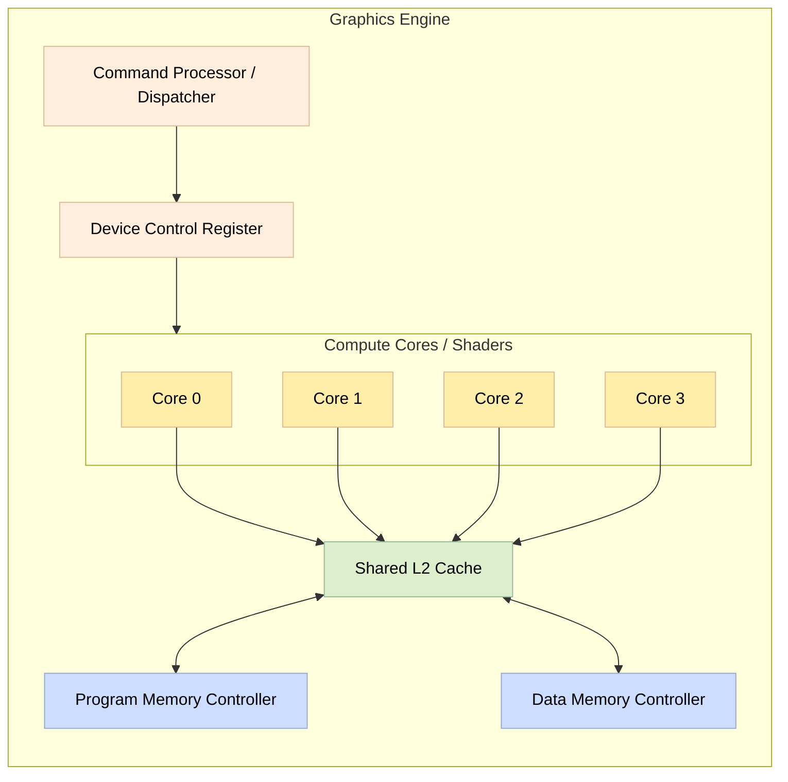
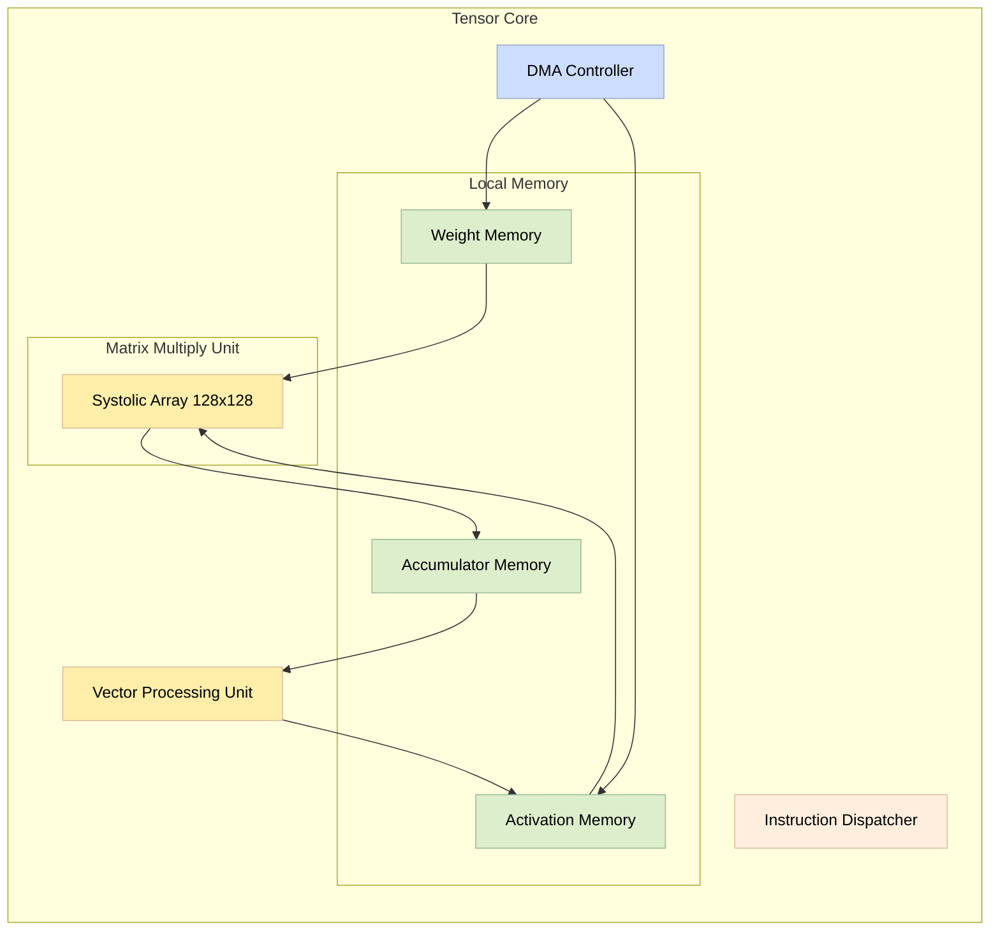
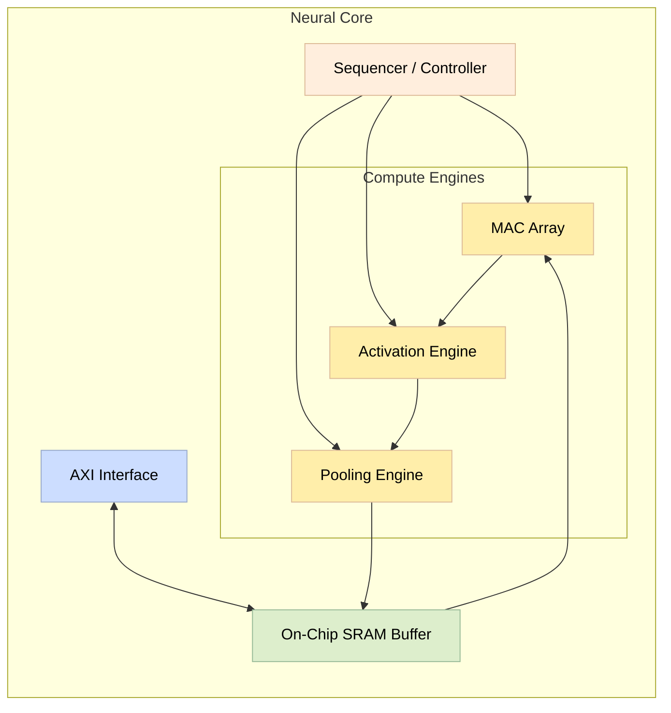

<div align="center">
  
  <p><strong>A Next-Generation Open-Source Unified Architecture</strong></p>
</div>

---

## 📖 Overview

**Project Wattstone** is a highly ambitious, general-purpose open-source System-on-Chip (SoC) designed to serve as a high-performance, power-efficient alternative to proprietary x86 and ARM processors. 

Taking inspiration from modern integrated architectures, Wattstone unites a high-performance Central Processing Unit (CPU), Graphics Engine (GPU), Tensor Processing Unit (TPU), and Neural Processing Unit (NPU) onto a single piece of silicon. 

Crucially, all of these computation units are connected via a **Unified Memory Architecture (UMA)** utilizing a shared System Level Cache (SLC). This eliminates massive memory-copy bottlenecks, radically reducing power consumption and heat generation while drastically increasing throughput for modern workloads (AI, parallel compute, graphics, and general OS tasks).

---

## 🏛️ Architecture & Die Layout

Below is a conceptual block diagram representing the Wattstone SoC die layout. The architecture is modular and built to scale efficiently.



### Unified Components Structure

To maintain a cohesive design language and simplify development, all architectural blocks in Wattstone are integrated under logical namespaces. Here is how they all connect together on the die:

<details open>
<summary><b>Wattstone Unified SoC Top Architecture</b></summary>


</details>

*   **Wattstone Compute Core (CPU)**: A high-performance, superscalar, Out-of-Order (OoO) RISC-V processor cluster. Serves as the primary orchestrator, fully capable of booting and running modern UNIX-based operating systems (Linux/BSD).
*   **Wattstone Graphics Engine (GPU)**: A massively parallel graphics processor for 3D rendering and high-bandwidth rasterization workloads.
*   **Wattstone Tensor Core (TPU)**: A dedicated matrix-multiplication engine for accelerating large-scale vector processing and complex mathematical models.
*   **Wattstone Neural Core (NPU)**: An ultra-efficient accelerator focused on running quantized machine learning inferencing (edge AI) with minimal power draw.
*   **Wattstone Display Engine (Low-Power GPU)**: A tiny, highly efficient 2D graphics co-processor for UI rendering, basic display output, and power-saving modes when the main Graphics Engine is asleep.
*   **System Level Cache (SLC)**: A massive, unified L3/SLC cache bank that all engines read from and write to simultaneously.
*   **Unified Memory Controller**: Manages the wide, high-speed connection to off-chip LPDDR memory, ensuring the shared memory pool is fed with maximum bandwidth.

### Detailed Component Architectures

Below are detailed block diagrams of the individual logic cores, structurally mirroring the clean architecture style of the Wattstone display pipeline. These diagrams render natively in Markdown viewers (like GitHub).

<details>
<summary><b>Wattstone Compute Core (CPU)</b></summary>


</details>

<details>
<summary><b>Wattstone Graphics Engine (GPU)</b></summary>


</details>

<details>
<summary><b>Wattstone Tensor Core (TPU)</b></summary>


</details>

<details>
<summary><b>Wattstone Neural Core (NPU)</b></summary>


</details>

---

## 📂 Repository Structure

```text
Wattstone/
├── hw/                   # Hardware designs and configurations
│   ├── rtl/              # SystemVerilog/Verilog integration code
│   │   ├── ip/           # Contains all Core IP blocks (CPU, GPU, NPU, TPU)
│   │   ├── slc/          # System Level Cache logic and controllers
│   │   ├── memory/       # DDR and memory controller wrappers
│   │   ├── interconnect/ # AXI/TileLink interconnect crossbars
│   │   └── wattstone_top.sv  # Main SoC wrapper uniting all blocks
├── sw/                   # Software ecosystem
│   ├── linux/            # Linux kernel source tree and Device Trees (DTS)
│   ├── drivers/          # Custom kernel drivers for GPU, TPU, and NPU
│   └── qemu/             # QEMU machine definitions for software emulation
├── docs/                 # Extended documentation and architecture specs
└── tests/                # System-level verification and testbenches
```

---

## 🚀 Getting Started

Wattstone is designed to be fully testable in simulation before moving to FPGA prototyping. We use QEMU to emulate the SoC architecture for rapid software development.

### 1. Prerequisites
Ensure you have the following installed on your development machine:
- Verilator & Chisel toolchains
- GNU RISC-V Cross-Compiler (`riscv64-unknown-linux-gnu-gcc`)
- QEMU (compiled for `riscv64` system emulation)

### 2. Booting Linux in Simulation
To test the Wattstone architecture and unified memory map in QEMU:

```bash
# 1. Compile the Wattstone Linux Kernel
cd sw/linux
make ARCH=riscv CROSS_COMPILE=riscv64-unknown-linux-gnu- defconfig
make ARCH=riscv CROSS_COMPILE=riscv64-unknown-linux-gnu- -j$(nproc)

# 2. Launch QEMU with the Wattstone Machine definition
cd ../qemu
./qemu-system-riscv64 -M wattstone -kernel ../linux/arch/riscv/boot/Image -nographic
```

---

## 🤝 Contributing

We welcome contributions to make open-source hardware a reality! 
When contributing, please:
1. Ensure all new logic uses the unified **Wattstone** naming conventions.
2. Update the Unified Memory Map (`hw/rtl/wattstone_memory_map.vh`) if adding new IP endpoints.
3. Verify your design against the unified AXI interconnect standards.

---
*Project Wattstone: Powering the next generation of open computing.*
